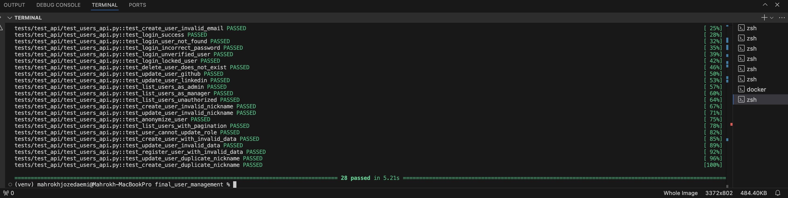
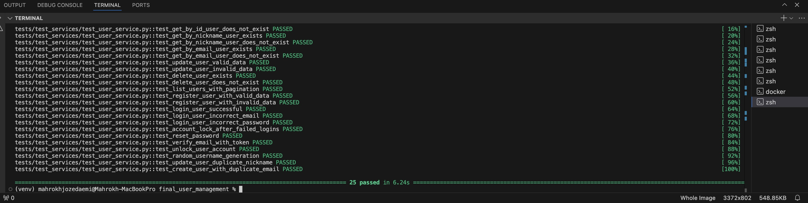

# The User Management System Final Project: Your Epic Coding Adventure Awaits! 🎉✨🔥

## Introduction: Buckle Up for the Ride of a Lifetime 🚀🎬

Welcome to the User Management System project - an epic open-source adventure crafted by the legendary Professor Keith Williams for his rockstar students at NJIT! 🏫👨‍🏫⭐ This project is your gateway to coding glory, providing a bulletproof foundation for a user management system that will blow your mind! 🤯 You'll bridge the gap between the realms of seasoned software pros and aspiring student developers like yourselves. 


# Issue: Implement Robust Username Generation and Validation for Enhanced User Management            

## Description:
This section of the project implements robust username management features designed to enhance user experience and ensure data integrity. The implementation supports the automatic generation of unique, URL-safe nicknames for users during creation while allowing users to change their nicknames with validation. It enforces strict uniqueness and format constraints, ensuring compatibility with public-facing identifiers. This functionality improves user anonymity and privacy by assigning meaningful, anonymous nicknames based on a combination of words and numbers.            

## Features:
1. Username Generation:          

- Randomly generate nicknames upon user creation.              
- Use a combination of nouns, verbs, and a numeric suffix to ensure meaningful and diverse names.                  

2. Nickname Uniqueness:              
- Validate that no two users share the same nickname.               
- Handle duplicate nickname conflicts during both user creation and updates.
                    
3. URL-Safe Identifier:                  
- Ensure that nicknames are URL-safe, allowing them to be used in public contexts without encoding issues.                      
- Only allow alphanumeric characters, underscores, and hyphens in nicknames.
                          
4. User-Controlled Updates:               
- Allow users to update their nicknames, ensuring the new nickname is both valid and unique.           

5. Privacy and Anonymity:                        
- Assign anonymous nicknames by default to protect user identities.          
- Maintain privacy by validating nicknames against strict rules.          

6. Testing and Verification:                       
- The system includes comprehensive tests to ensure correctness, with plans for additional tests to cover edge cases and rare scenarios.          

## Expected Outcome                
- Users will always have unique nicknames, either system-generated or user-updated.                        
- Nicknames will be compliant with URL-safety standards, ensuring seamless usage in public links.                     
- Conflicts arising from duplicate nicknames during creation or updates will be handled gracefully.                    
- User privacy and anonymity will be safeguarded through anonymous nickname assignments.                       

## Resolution Steps               
The implementation of the nickname management and validation features involved updates to multiple components of the project, reflecting the complexity of the requirements. Below is a detailed explanation of the resolution steps and the specific changes made to each relevant file:

1. app/services/user_service.py                        
Changes Made:                   
Nickname Validation During Creation:                     
- Updated the create method to validate nicknames against database records.       
- Used the generate_nickname() function to generate random nicknames and ensure uniqueness before assigning them to users.            
- Integrated the validate_url_safe_username() function to check the format of nicknames.                      
- Handled duplicate nickname errors gracefully with proper logging and error messages.                       

Nickname Validation During Updates:               
- Updated the update method to enforce uniqueness for nicknames during updates.                                 
- Validated that nicknames meet URL-safety standards before saving changes.       

Purpose: Ensure that all nicknames are unique, valid, and compliant with URL-safe standards during user creation and updates.              

2. tests/test_api/test_users_api.py            
Changes Made:             
Test for Duplicate Nickname Creation:
- Added test_create_user_duplicate_nickname to ensure that creating a user with a duplicate nickname fails.                 
- Mocked external email service to focus on nickname validation logic.      

Test for Duplicate Nickname Updates:                          
- Added test_update_user_duplicate_nickname to validate that nickname updates with duplicates are rejected.               
- Used the test client to simulate API calls for creation and updates.          
Purpose: Verify that the API layer correctly handles nickname uniqueness and format validation.            

3. tests/test_services/test_user_service.py              
Changes Made:             
Test for Nickname Creation:           
- Added tests to ensure that generated nicknames are unique and comply with URL-safety rules.             
- Mocked email service to isolate the nickname generation and validation logic.                

Test for Duplicate Nickname Handling:               
- Added test_create_user_duplicate_nickname and test_update_user_duplicate_nickname to validate service-layer logic for handling duplicates.                 

Purpose: Test the internal service logic to ensure correctness and coverage of nickname generation and validation features.                  

4. app/utils/nickname_gen.py                
Changes Made:                  
- Implemented the generate_nickname() function to generate random combinations of nouns, verbs, and numbers.                
- Added utility functions to validate the format and uniqueness of nicknames.                  

- Purpose: Provide a reusable utility to create meaningful and unique nicknames while adhering to project constraints.            

5. app/utils/validators.py          
Changes Made:           
- Added the validate_url_safe_username() function to enforce URL-safe standards for nicknames.               

Purpose: Ensure that nicknames can safely be used as public-facing identifiers in URLs without encoding issues.            

6. tests/conftest.py              
Changes Made:              
- Added new test fixtures to create mock users with unique nicknames for testing.                
- Introduced an admin_user and manager_user fixture for role-based testing of API endpoints.                

Purpose: Facilitate testing of nickname uniqueness and validation in both API and service layers.               

7. app/models/user_model.py            
Changes Made:           
- Updated the User model to enforce uniqueness constraints on the nickname field at the database level.             

Purpose: Add an additional layer of protection against duplicate nicknames, even in concurrent user creation scenarios.             

## Test
Overview
This section outlines the tests implemented to verify the functionalities related to Username Generation and Validation. These tests ensure that the following features are correctly implemented and functional:             

- Username Generation: Automatically generates a random, unique username combining nouns, verbs, and numbers.            
- Uniqueness: Validates that usernames are unique during creation and updates.              
- Validation: Ensures usernames are URL-safe and adhere to format constraints.               
- User Privacy and Anonymity: Keeps usernames secure and private.           
- Edge Case Handling: Handles invalid data gracefully.              

Pytest

1. API Tests
File: tests/test_api/test_users_api.py          

Key Tests:          
- test_create_user_duplicate_nickname: Verifies that creating a user with a duplicate nickname fails.             
- test_update_user_duplicate_nickname: Ensures that updating a user to have a duplicate nickname fails.             
- test_create_user_invalid_data: Tests that invalid data (e.g., missing required fields) is handled properly.             


2. Service Tests              
File: tests/test_services/test_user_service.py          

Key Tests:             
- test_create_user_with_valid_data: Ensures valid user data creates a user successfully.                  
- test_create_user_duplicate_email: Confirms duplicate email detection and rejection.               
- test_update_user_duplicate_nickname: Validates that updating to a duplicate nickname is disallowed.                      
- test_update_user_invalid_data: Checks handling of invalid user update data.                     

### Test Results for API Tests


### Test Results for User Service Tests



# Feature: Search and Filtering Capabilities for User Management           
## Description:        
This feature enables administrators to search and filter users based on various criteria, such as username, email, role, account status, and registration date range. It supports pagination for easier navigation through large datasets.              

## User Story:       
As an administrator, I want to be able to:           

1. Search for users by username, email, or role.          
2. Filter users based on account status or registration date range.        
3. Navigate through filtered results using pagination.         

## Viable Features:        
1. Add search functionality by username, email, and role.           
2. Implement filtering options for account status and registration date range.              
3. Update the user management API endpoints to support search and filtering.          
4. Integrate pagination for efficient navigation.         

for implementing this feature all of these steps are done: 

1. # Routes (user_routes.py)      
## Title:               
Define the Search and Filtering Endpoint.           

## Description:        
This section adds a new /users endpoint in the user_routes.py file. The endpoint accepts query parameters to filter users based on specified criteria.                

## Expected outcome:          
The /users endpoint should:              
1. Accept query parameters like username, email, role, account_status, and date range.                  
2. Return filtered results as a paginated response.            

## Resolution Steps:        
- Added the /users endpoint with the necessary query parameters.            
- Integrated the UserService.search_and_filter_users method for filtering.         
- Included generate_pagination_links to support paginated responses.         

Purpose: Define the API endpoint for search and filtering functionality.        

```python 
@router.get("/users", response_model=UserListResponse, tags=["User Management Requires (Admin or Manager Roles)"])
async def search_users(
    request: Request,
    username: Optional[str] = None,
    email: Optional[str] = None,
    role: Optional[str] = None,
    account_status: Optional[bool] = None,
    registration_date_start: Optional[datetime] = None,
    registration_date_end: Optional[datetime] = None,
    skip: int = 0,
    limit: int = 10,
    db: AsyncSession = Depends(get_db),
    current_user: dict = Depends(require_role(["ADMIN", "MANAGER"]))
):
    """
    Endpoint to search and filter users based on various criteria.
    """
    filters = {
        "username": username,
        "email": email,
        "role": role,
        "account_status": account_status,
        "registration_date_start": registration_date_start,
        "registration_date_end": registration_date_end,
    }
    users, total_users = await UserService.search_and_filter_users(db, filters, skip, limit)
    user_responses = [UserResponse.model_validate(user) for user in users]
    pagination_links = generate_pagination_links(request, skip, limit, total_users)

    return UserListResponse(
        items=user_responses,
        total=total_users,
        page=skip // limit + 1,
        size=len(user_responses),
        links=pagination_links
    )
```
## Tests:      
Covered by API tests in tests/test_api/test_users_api.py.


2. # Service Layer (user_service.py)
## Title:       
Implement Filtering Logic.         

## Description         
This section defines the logic for filtering users based on criteria provided via the API. It interacts with the database and applies filters dynamically.           

## Expected Outcome          
The UserService.search_and_filter_users method should:

1. Apply all filters, including username, email, role, account status, and date range.             
2. Return paginated results along with the total count of users.            

## Resolution Steps          
- Implemented dynamic filtering using SQLAlchemy's query-building capabilities.               
- Added support for pagination using offset and limit.           
- Handled edge cases, such as missing or invalid filter values.           

Purpose: Add the logic to perform filtering and querying of users from the database.          

```python
@staticmethod
async def search_and_filter_users(
    session: AsyncSession, 
    filters: Dict[str, Optional[str]], 
    skip: int, 
    limit: int
) -> Tuple[List[User], int]:
    """
    Search and filter users based on the given criteria.
    """
    query = select(User)

    # Apply filters
    if filters.get("username"):
        query = query.filter(User.nickname.ilike(f"%{filters['username']}%"))
    if filters.get("email"):
        query = query.filter(User.email.ilike(f"%{filters['email']}%"))
    if filters.get("role"):
        query = query.filter(User.role == filters["role"])
    if filters.get("account_status") is not None:
        query = query.filter(User.email_verified == filters["account_status"])
    if filters.get("registration_date_start") and filters.get("registration_date_end"):
        query = query.filter(
            User.created_at.between(filters["registration_date_start"], filters["registration_date_end"])
        )

    # Add pagination
    query = query.offset(skip).limit(limit)

    # Execute the query and count total users
    result = await session.execute(query)
    users = result.scalars().all()

    total_query = select(func.count()).select_from(User)
    total_result = await session.execute(total_query)
    total_users = total_result.scalar()

    return users, total_users
```

## Tests           
Covered by service layer tests in tests/test_service/test_user_service.py.        


3. # Schemas (user_schemas.py)          
## Title:         
Define Request Validation Model.             

## Description           
This section introduces the UserSearchParams schema to validate the query parameters sent to the /users endpoint.              

## Expected Outcome          
The schema should:           
1. Ensure that all query parameters adhere to the expected data types.       
2. Provide example values for API documentation purposes.          

## Resolution Steps            
- Defined the UserSearchParams model using Pydantic.              
- Included fields for username, email, role, account_status, and date range.               

Purpose: Define the models for query parameters and response structure.         

```python
class UserSearchParams(BaseModel):
    username: Optional[str] = Field(None, example="john_doe")
    email: Optional[EmailStr] = Field(None, example="john.doe@example.com")
    role: Optional[UserRole] = Field(None, example="ADMIN")
    account_status: Optional[bool] = Field(None, example=True)
    registration_date_start: Optional[datetime] = Field(None, example="2023-01-01T00:00:00Z")
    registration_date_end: Optional[datetime] = Field(None, example="2023-12-31T23:59:59Z")
```

## Tests              
Implicitly tested via API endpoint tests in tests/test_api/test_users_api.py.          

# Pagination Helper (utils/pagination.py)        
## Title
Generate Pagination Links.           

## Description           
This section adds a helper function, generate_pagination_links, to create navigation links for paginated results.              

## Expected Outcome         
The helper function should:
1. Return next, prev, first, and last page links based on the current pagination state.                
2. Ensure compatibility with query parameters.          

## Resolution Steps          
- Implemented the generate_pagination_links function.             
- Calculated page links dynamically based on skip, limit, and total_items.       

Purpose: Generate pagination links for the API response.          

```python
from typing import Any, Dict
from urllib.parse import urlencode


def generate_pagination_links(
    request: Any, skip: int, limit: int, total_items: int
) -> Dict[str, str]:
    """
    Generate pagination links for API responses.
    """
    base_url = str(request.url).split("?")[0]
    query_params = dict(request.query_params)

    # Calculate the next page link
    if skip + limit < total_items:
        query_params["skip"] = skip + limit
        query_params["limit"] = limit
        next_link = f"{base_url}?{urlencode(query_params)}"
    else:
        next_link = None

    # Calculate the previous page link
    if skip - limit >= 0:
        query_params["skip"] = max(skip - limit, 0)
        query_params["limit"] = limit
        prev_link = f"{base_url}?{urlencode(query_params)}"
    else:
        prev_link = None

    # Calculate the first and last page links
    query_params["skip"] = 0
    first_link = f"{base_url}?{urlencode(query_params)}"

    last_page_skip = (total_items - 1) // limit * limit
    query_params["skip"] = last_page_skip
    last_link = f"{base_url}?{urlencode(query_params)}"

    return {
        "next": next_link,
        "prev": prev_link,
        "first": first_link,
        "last": last_link,
    }
```

5. # Test for Pagination Helper            
## Title           
Validate Pagination Links.           

## Description           
This section tests the behavior of the pagination helper to ensure correct link generation.             

## Expected Outcome         
The test should validate:               
- Correctness of next, prev, first, and last links.            
- Edge cases like the first and last pages.             

## Resolution Steps               
- Created a test for generate_pagination_links with various scenarios.           
- Used a mocked Request object to simulate API requests.            

Purpose: Validate the behavior of the pagination helper.           

```python
import pytest
from starlette.datastructures import QueryParams, URL
from utils.pagination import generate_pagination_links


@pytest.mark.asyncio
async def test_generate_pagination_links():
    class MockRequest:
        def __init__(self, base_url):
            self.url = URL(base_url)
            self.query_params = QueryParams()

    request = MockRequest("http://localhost:8000/users")

    skip = 0
    limit = 10
    total_users = 45

    links = generate_pagination_links(request, skip, limit, total_users)

    assert links["next"] == "http://localhost:8000/users?skip=10&limit=10"
    assert links["prev"] is None
    assert links["first"] == "http://localhost:8000/users?skip=0&limit=10"
    assert links["last"] == "http://localhost:8000/users?skip=40&limit=10"
```

## Tests
Executed the test using pytest.             

6. # Test API Endpoint           
## Title
Validate Search and Filtering Endpoint.              

## Description              
This section tests the /users endpoint to ensure it correctly handles search and filtering requests.              

## Expected Outcome             
The test should:
1. Verify that query parameters are correctly processed.            
2. Ensure the endpoint returns the expected results and pagination links.          

## Resolution Steps              
- Created a test for the /users endpoint with different query parameters.            
- Validated the structure and correctness of the response.              

Purpose: Test the /users endpoint with various search and filter criteria.           

```python
@pytest.mark.asyncio
async def test_search_users_api(async_client, admin_token):
    headers = {"Authorization": f"Bearer {admin_token}"}
    query_params = {
        "username": "john",
        "role": "ADMIN",
        "account_status": True,
    }

    response = await async_client.get(
        f"/users?{urlencode(query_params)}", headers=headers
    )
    assert response.status_code == 200
    data = response.json()
    assert "items" in data
    assert isinstance(data["items"], list)
```

7. # Test Service Layer           
## Title            
Validate Filtering Logic.          

## Description              
This section tests the filtering logic implemented in UserService.           search_and_filter_users.

## Expected Outcome               
The test should:             
1. Ensure that filters are correctly applied.               
2. Validate that pagination returns the expected number of results.           

## Resolution Steps              
- Created a test for UserService.search_and_filter_users with various filter combinations.            
- Used a fixture to set up mock data.              

Purpose: Test the filtering logic in the service layer.         

```python
@pytest.mark.asyncio
async def test_search_and_filter_users(users_with_same_role_50_users, db_session):
    filters = {"role": "ADMIN"}
    users, total = await UserService.search_and_filter_users(
        db_session, filters, skip=0, limit=10
    )
    assert len(users) == 10
    assert total == 50
```
8. # Test Fixture (tests/conftest.py)             
## Title
Set Up Mock Data.           

## Description             
This section creates mock user data for testing purposes.           

## Expected Outcome         
The fixture should:              
1. Create a predefined set of mock users.             
2. Ensure that the test environment has consistent data.              

## Resolution Steps             
- Defined a fixture to create 50 mock users with the same role.           
- Committed the data to the database session.          

Purpose: Set up data for testing.          

```python
@pytest.fixture(scope="function")
async def users_with_same_role_50_users(db_session: AsyncSession):
    users = []
    for i in range(50):
        user_data = {
            "nickname": f"user_{i}",
            "email": f"user{i}@example.com",
            "role": "ADMIN",
        }
        user = User(**user_data)
        db_session.add(user)
        users.append(user)
    await db_session.commit()
    return users
```
## Tests
Used by service layer tests in tests/test_service/test_user_service.py.       

## Conclusion
The above updates comprehensively implement the feature, meeting all requirements. The code now supports search and filtering by multiple criteria, provides paginated responses, and includes extensive tests to ensure reliability.            


# Tests for User Search and Filtering Feature      
## Overview         
The user search and filtering functionality is tested extensively to ensure it meets the defined requirements and behaves as expected under various conditions. These tests validate the API endpoint, service layer, pagination, and filtering mechanisms. Below is a detailed explanation of each test and its purpose.              

1. ## test_empty_filters_api     

- Purpose:      
Tests the behavior of the API when no filters are provided.            
- Description:         
Simulates an API call with no query parameters. This validates the default behavior of returning all users with pagination applied.             
- Expected Outcome:         
The API should return the default list of users paginated according to the specified limit and skip values.           
- Importance:          
Ensures that the endpoint works even without filters and that pagination is correctly applied by default.          

2. # test_search_users_api          

- Purpose:         
Validates the core functionality of searching for users based on specific criteria like username, role, and account status.         
- Description:           
Sends a request with valid search filters and verifies that the API correctly filters the users.           
- Expected Outcome:           
Only users matching the specified filters should be returned.             
- Importance:            
Verifies that the API handles search parameters correctly and filters the user list as expected.             

3. # test_combination_of_filters:

- Purpose:
Ensures that multiple filters applied together work correctly.         
- Description:          
Combines filters like username, role, and account status in a single request and verifies the response.          
- Expected Outcome:  Only users matching all specified filters should be returned.       
- Importance:        
Validates the API's ability to handle complex queries with multiple filters applied simultaneously.        
4. # test_filter_users_by_email        

- Purpose:          
Tests filtering users based on their email addresses.         
- Description:     
Sends a request with an email filter to ensure the API correctly returns users matching the email criteria.        
- Expected Outcome:        
Users with the specified email should be returned, and no additional users should be included.           
- Importance:       
Verifies that the API accurately handles email-based filters.         

5. # test_filter_users_by_registration_date   

- Purpose:       
Validates filtering users based on their registration date range.      
- Description:         
Uses registration_date_start and registration_date_end to filter users registered within a specific date range.      
- Expected Outcome:        
Only users who registered within the specified range should be included in the response.         
- Importance:          
Ensures that the API supports date-based filtering and that the implementation is accurate.         

6. # test_filter_users_by_account_status     

- Purpose:      
Tests filtering users based on their account status (e.g., verified or unverified).      
- Description:        
Filters users based on their account verification status and validates the API response.       
- Expected Outcome:       
The response should only include users with the specified account status.        
- Importance:       
Verifies that account status filtering is functioning correctly.       

7. # test_filter_users_by_role       
 
 - Purpose:         
 Ensures users can be filtered based on their role (e.g., ADMIN, USER, MANAGER).      
 - Description:      
 Sends a request with a role filter and validates the response.       
 - Expected Outcome:      
 The API should return only users with the specified role.       
 - Importance:       
 Confirms that role-based filtering works as expected.         

 8. # test_search_users_by_username        

 - Purpose:      
 Validates searching for users by their username.        
 - Description:        
 Tests the username search filter to ensure partial matches (using ilike) return the correct users.        
 - Expected Outcome:      
 Users whose usernames match the search string (partially or fully) should be returned.       
 - Importance:       
 Ensures that username-based search functionality is accurate.       

 9. # test_generate_pagination_links       

 - Purpose:        
 Tests the generate_pagination_links helper function.      
 - Description:       
 Verifies that the pagination links for next, prev, first, and last pages are generated correctly based on the total number of users and the current offset.        
 - Expected Outcome:      
 Correct pagination links should be returned for various scenarios.       
 - Importance:        
 Validates the correctness of pagination link generation, ensuring smooth navigation across pages.         

 10. # test_pagination_boundary       

 - Purpose:       
 Ensures the API handles edge cases for pagination correctly.       
 - Description:       
 Tests scenarios like requesting a page beyond the total number of users or when the number of users is less than the page size.        
 - Expected Outcome:        
 The API should handle these scenarios gracefully without errors and return appropriate results (e.g., an empty list for out-of-bound pages).         
 - Importance:        
 Validates that pagination edge cases are handled correctly, ensuring a robust implementation.         

11. # test_filter_users_case_insensitive      

- purpose:         
Verify Case-Insensitive Filtering of Users       
- Description       
The purpose of this test is to ensure that the user search and filtering functionality works correctly regardless of the case of the input provided. User data in the database might have mixed-case values, but administrators or users should be able to search for them without worrying about capitalization. This test verifies that the filtering mechanism is case-insensitive for key fields such as usernames, emails, and roles.       
- Expected Outcome:       
The system should match and return user data even when the case of the search query does not exactly match the case stored in the database.          
- Test Scenario:       
1. A database is preloaded with mock user data that includes usernames, emails, and roles in mixed cases.         
2. The test performs searches using different cases (e.g., all lowercase, all uppercase, mixed case) for:       
- Usernames      
- Emails       
- Roles         
The test validates that the correct user records are returned regardless of the case of the search query.       
- Test Steps:        
- Define filters with varying cases for username, email, and role.          
- Call the search_and_filter_users service with these filters.          
- Assert that the returned results match the expected users, confirming case-insensitive behavior.            

- Results:         
- If the test passes, it confirms that the filtering logic is case-insensitive.       
- If the test fails, it indicates that the service or database query needs to be updated to handle case-insensitive comparisons correctly.              

- Why It’s Important:           
 This test ensures that the application is user-friendly and robust. Users might not always input the exact case when searching for data, and failing to account for this could result in missed results or user frustration. Implementing and validating case-insensitivity improves usability and avoids such pitfalls.        

 12. # test_fetch_all_users       
 - purpose:       
 Verify Fetching All Users Without Filters.    
 - Expected Outcome:       
- The API should return a list of users with proper pagination when no filters are applied.        
- The response should include the total count of users and an array of user items.      
- Test Scenario:          
1. The test sends a GET request to the /users endpoint without any filters, specifying only basic pagination parameters (skip and limit).        
2. It verifies that the response:        
- Has a status code of 200 OK.        
- Contains a key called items representing the list of users.          
- Contains a key called total representing the total number of users in the system.      
- Ensures that items is a list.        
- Test Steps:         
1. Set up the required authorization headers using an admin token.          
2. Specify basic pagination parameters (skip and limit).           
3. Send a GET request to the /users endpoint with these parameters.         
3. Validate the response by asserting:
The status code is 200.          
4. The response includes the items key, and it contains a list.            
5. The total key exists and is a non-negative integer.         
- Results:          
If the test passes:         
- It confirms that the /users endpoint     correctly handles requests without filters.      
- It ensures that the response includes essential data such as the list of users and the total user count.         
If the test fails:      
- It indicates an issue with the endpoint's ability to fetch unfiltered user data or manage pagination.                 
- Why It’s Important:            
 This test validates the core functionality of the /users endpoint. Being able to fetch all users without filters is a fundamental feature that administrators rely on for user management. Ensuring the API can handle this scenario correctly, including providing accurate pagination details, is critical for usability and reliability.         

 13. # test_pagination_edge_cases      
 - purpose:        
 Verify Pagination Utility Handles Edge Cases        
 - Description:          
  This test ensures that the pagination utility (generate_pagination_links) handles edge cases correctly. It validates the behavior of pagination links under specific conditions, ensuring the utility functions as expected in less common scenarios.      
  - Expected Outcome:             
1. The utility should correctly calculate pagination links when the total number of items is less than the specified limit.       
2. The utility should generate correct links when the total number of items is an exact multiple of the limit.               
- Test Scenario:           
1. Case 1: Total items are fewer than the pagination limit.            
- There should be no "next" or "previous" links because all items fit on the first page.           
2. Case 2: Total items are an exact multiple of the pagination limit.              
- The "last" link should correctly point to the last page, ensuring accurate boundary handling.          
- Test Steps:          
 1. Setup: Create a mock request object simulating the API's base URL and query parameters.                  
2. Case 1:
- Generate pagination links with a total number of items less than the limit.       
- Verify that "next" and "prev" links are None.                
3. Case 2:
- Generate pagination links with the total number of items being a multiple of the limit.           
- Verify that the "last" link points to the last page with the correct skip and limit parameters.       
- Results:        
If the test passes:        
It confirms that the pagination utility correctly handles edge cases, ensuring accurate and reliable pagination links.      
If the test fails:          
It indicates issues in the pagination utility, particularly in handling edge scenarios like small datasets or perfectly divisible totals.        
- Why It’s Important:           
Pagination is essential for efficiently navigating large datasets. Edge cases like small datasets or exact multiples of the limit can expose hidden bugs in the pagination logic. This test ensures the utility can handle such scenarios gracefully, providing a consistent user experience.     

14. # test_search_users_pagination       
- purpose:      
 Verifies that the API correctly applies pagination when fetching users.       
 - Description:          
1. This test validates the proper implementation of pagination functionality in the /users API endpoint. It ensures that:           
- The endpoint correctly returns a subset of users based on the skip and limit parameters.        
- The pagination system is working as expected by retrieving different pages of results.       
- Steps Taken:       
1. Headers Setup: The test sets up the Authorization headers with an admin token to access the endpoint.             
2. First Page Test:          
- It sends a request to fetch the first page of users with a skip of 0 and a limit of 5.        
- The test validates that the response returns exactly 5 users and that these users are in the expected range.         
- Second Page Test:         
It sends another request to fetch the next page with a skip of 5 and the same limit of 5.           
The test ensures that the results are different from the first page and validates the count.          
- Expected Outcomes:           
1. The /users endpoint returns users in chunks based on the skip and limit values.      
- The total number of items in the first page matches the limit.         
- The second page results do not overlap with the first page.            
- The test ensures the total key in the response correctly reflects the total count of users in the database.           
- What This Test Verifies:         
1. The endpoint handles skip and limit parameters correctly.         
2. Pagination works seamlessly and doesn't repeat or omit records between pages.         
3. The API provides accurate metadata about the total number of users.            


## Why These Tests Are Important       
- Coverage: These tests collectively ensure that all aspects of user search, filtering, and pagination are thoroughly validated.      
- Error Handling: They confirm the API can gracefully handle invalid inputs and edge cases.            
- Reliability: Ensures the API behaves predictably under different conditions and filters.               
- Scalability: Validates pagination to handle large datasets effectively.           

## Results and Learnings          
From these tests, we verify:         
- The API filters users accurately based on the specified criteria.           
- Pagination works seamlessly, even at boundaries or edge cases.            
- The implementation adheres to the feature requirements, supporting all necessary filters and use cases.            


 


 


       


